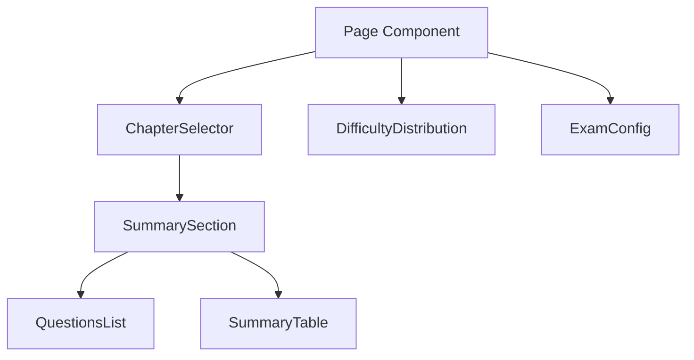

# Exam Question Paper Generator

A SvelteKit application for creating and managing exam question papers with an intuitive user interface.

## 🚀 Tech Stack

- **Framework:** SvelteKit
- **Styling:** TailwindCSS
- **Charts:** Chart.js
- **Font:** Inter (Google Fonts)

## 📚 Libraries & Dependencies

```json
{
  "dependencies": {
    "@sveltejs/kit": "^2.0.0",
    "chart.js": "^4.0.0",
    "svelte": "^4.0.0",
    "tailwindcss": "^3.0.0"
  }
}
```

## 🎨 Design Standards

### Typography
- Primary Font: Inter
- Font Weights: 400 (regular), 500 (medium), 600 (semibold), 700 (bold)
- Base Font Size: 16px (1rem)

### Color Palette
```css
/* Primary Colors */
--primary-blue: #2563eb;     /* bg-blue-600 */
--primary-green: #22c55e;    /* bg-green-500 */
--primary-red: #ef4444;      /* bg-red-500 */

/* Text Colors */
--text-primary: #374151;     /* text-gray-700 */
--text-secondary: #6B7280;   /* text-gray-500 */

/* Background Colors */
--bg-white: #ffffff;         /* bg-white */
--bg-gray-light: #F9FAFB;    /* bg-gray-50 */
```

### Component Standards

#### Cards
- Rounded corners (lg)
- White background
- Light shadow
- 1.5rem padding (p-6)
- Bottom margin (mb-6)

#### Form Elements
- Input height: 2.5rem (h-10)
- Border radius: 0.375rem (rounded-md)
- Focus states with blue ring
- Required fields marked with red asterisk

#### Buttons
- Primary: Blue background with hover state
- Secondary: Gray border with hover state
- Danger: Red text/border with hover state
- Border radius: 0.375rem (rounded-md)

## 🏗️ Project Structure

```
src/
├── lib/
│   ├── components/
│   │   ├── ActionButtons.svelte
│   │   ├── Card.svelte
│   │   ├── ChapterSelector.svelte
│   │   ├── DifficultyDistribution.svelte
│   │   ├── Dropdown.svelte
│   │   ├── ExamConfig.svelte
│   │   ├── Input.svelte
│   │   ├── QuestionsList.svelte
│   │   ├── RadioGroup.svelte
│   │   ├── SummarySection.svelte
│   │   └── TabButton.svelte
│   └── stores/
│       └── questionStore.js
├── routes/
│   ├── +layout.svelte
│   └── +page.svelte
└── app.html
```

## 🔧 Component Architecture

### Reusable Components
1. **Base Components**
   - Input
   - Dropdown
   - RadioGroup
   - Card
   - TabButton
   - ActionButton

2. **Complex Components**
   - DifficultyDistribution (with Chart.js integration)
   - ChapterSelector
   - QuestionsList
   - SummarySection

### State Management
- Uses Svelte stores for global state
- Reactive updates for selected groups and questions
- Proper data flow between parent and child components

## 📝 Coding Standards

1. **Component Organization**
   - Single responsibility principle
   - Props documentation
   - Clear component interfaces

2. **Event Handling**
   - Custom event dispatching
   - Proper event bubbling
   - Type-safe event handlers

3. **Reactivity**
   - Proper use of reactive statements
   - Store subscriptions cleanup
   - Reactive declarations when needed

4. **Styling**
   - TailwindCSS utility classes
   - Consistent spacing
   - Responsive design patterns

## 🔄 Data Flow



## 🚀 Future Enhancements

1. **API Integration**
   ```javascript
   GET /api/questions
   POST /api/groups
   PUT /api/groups/:id
   DELETE /api/groups/:id
   ```

2. **Features**
   - Advanced filtering
   - Question preview
   - Multiple paper versions
   - PDF export

## 📋 Setup Instructions

1. Clone the repository
2. Install dependencies:
   ```bash
   npm install
   ```
3. Start development server:
   ```bash
   npm run dev
   ```
4. Build for production:
   ```bash
   npm run build
   ```

## 🤝 Contributing

Follow these steps for contributions:
1. Fork the repository
2. Create a feature branch
3. Commit changes
4. Push to the branch
5. Open a pull request

## 📄 License

MIT License